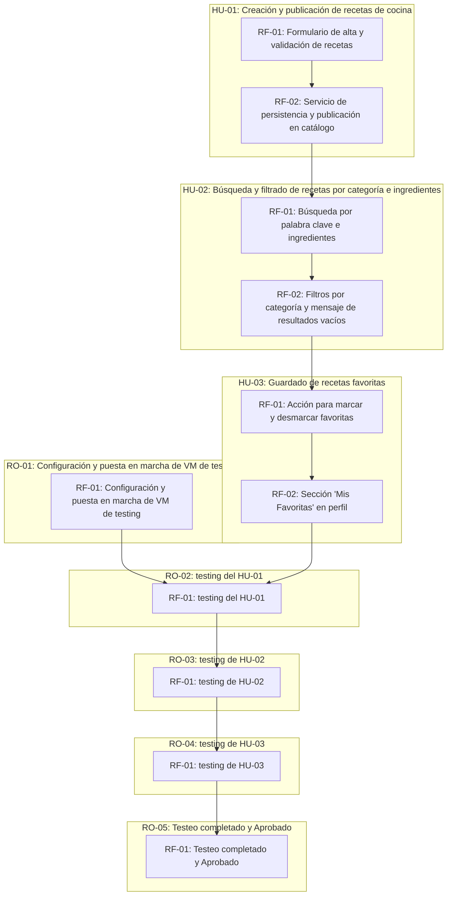

# Grafo de Dependencias --  RecetasPanaRossi

_Generado automaticamente el 2026-09-07T18:58:21.286Z -- no editar a mano, se sobreescribe en cada publicacion._

```mermaid
graph TD
  subgraph US_1788784804716["HU-01: Creación y publicación de recetas de cocina"]
    REQ_1788785182545["RF-01: Formulario de alta y validación de recetas"]
    REQ_1788785196739["RF-02: Servicio de persistencia y publicación en catálogo"]
  end
  subgraph US_1788784817567["HU-02: Búsqueda y filtrado de recetas por categoría e ingredientes"]
    REQ_1788785446610["RF-01: Búsqueda por palabra clave e ingredientes"]
    REQ_1788785477255["RF-02: Filtros por categoría y mensaje de resultados vacíos"]
  end
  subgraph US_1788784829317["HU-03: Guardado de recetas favoritas"]
    REQ_1788785498187["RF-01: Acción para marcar y desmarcar favoritas"]
    REQ_1788785510602["RF-02: Sección 'Mis Favoritas' en perfil"]
  end
  subgraph US_1788785524805["RO-01: Configuración y puesta en marcha de VM de testing"]
    REQ_1788785524811["RF-01: Configuración y puesta en marcha de VM de testing"]
  end
  subgraph US_1788790818388["RO-02: testing del HU-01"]
    REQ_1788790818395["RF-01: testing del HU-01"]
  end
  subgraph US_1788790905857["RO-03: testing de HU-02"]
    REQ_1788790905863["RF-01: testing de HU-02"]
  end
  subgraph US_1788790968088["RO-04: testing de HU-03"]
    REQ_1788790968095["RF-01: testing de HU-03"]
  end
  subgraph US_1788791159528["RO-05: Testeo completado y Aprobado"]
    REQ_1788791159536["RF-01: Testeo completado y Aprobado"]
  end
  REQ_1788785182545 --> REQ_1788785196739
  REQ_1788785196739 --> REQ_1788785446610
  REQ_1788785446610 --> REQ_1788785477255
  REQ_1788785477255 --> REQ_1788785498187
  REQ_1788785498187 --> REQ_1788785510602
  REQ_1788785524811 --> REQ_1788790818395
  REQ_1788785510602 --> REQ_1788790818395
  REQ_1788790818395 --> REQ_1788790905863
  REQ_1788790905863 --> REQ_1788790968095
  REQ_1788790968095 --> REQ_1788791159536
```